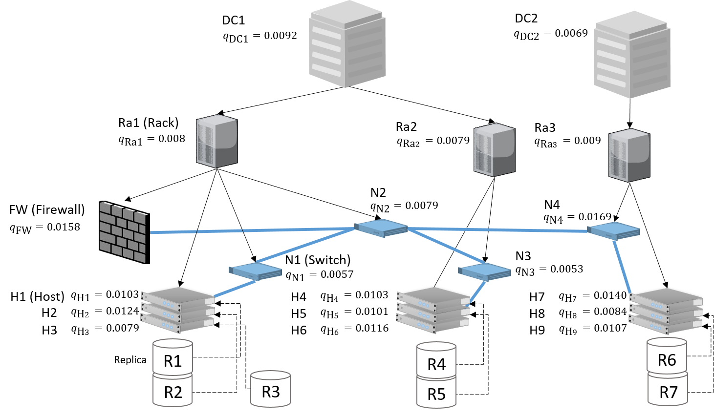

# Availability Analysis with Bayesian Networks and Fault Trees

Modeling framework to asses the availability of quorum-based replicated systems,
considering infrastructure and network of the modeled system.

## Setup

### Python 3 Setup

Install necessary python packages with:

```
> python3 -m pip install -r requirements.txt   
```

### R Setup

The BN evaluation uses two R packages.

Download `bnlearn` version `4.5` from [source](https://cran.r-project.org/src/contrib/Archive/bnlearn/) .

Download `gRain` version `1.3.2` from [source](https://cran.r-project.org/src/contrib/Archive/gRain/).

Open R in your terminal, and  install `gRain` and  `bnlearn`:

```
install.packages("path_to_file/to/gRain_1.3-2.tar.gz", repos = NULL, type="source")
install.packages("path_to_file/to/bnlearn_4.5.tar.gz", repos = NULL, type="source")
```

### Install SCRAM

The FT evaluation uses the SCRAM CLI. 
Download SCRAM from [SourceForge](https://sourceforge.net/projects/iscram/) or compile from [source](https://github.com/rakhimov/scram) and make sure `scram` is availability 
in your `PATH` environment.

## How to Describe a System

To describe your system you need two models.
The model of the infrastructure and the model of the replicated system.
Both models use JSON as concrete syntax. 

A simple example will illustrate both models. 
Example of the infrastructure model (from `Assests/simple_service/graph.json`) 
```JSON

{
  "components": [
    {
      "name": "D1",
      "availability": 0.9908
    },
    {
      "name": "D2",
      "availability": 0.9931
    },
    {
      "name": "R1",
      "availability": 0.9920
    },
    {
      "name": "R2",
      "availability": 0.9921
    },
    {
      "name": "R3",
      "availability": 0.9910
    },
    {
      "name": "H1",
      "availability": 0.9897,
      "type": "host"
    },
    {
      "name": "H2",
      "availability": 0.9876,
      "type": "host"
    },
    {
      "name": "H3",
      "availability": 0.9921,
      "type": "host"
    },
    {
      "name": "H4",
      "availability": 0.9897,
      "type": "host"
    },
    {
      "name": "H5",
      "availability": 0.9899,
      "type": "host"
    },
    {
      "name": "H6",
      "availability": 0.9884,
      "type": "host"
    },
    {
      "name": "H7",
      "availability": 0.9860,
      "type": "host"
    },
    {
      "name": "H8",
      "availability": 0.9916,
      "type": "host"
    },
    {
      "name": "H9",
      "availability": 0.9893,
      "type": "host"
    },
    {
      "name": "FW",
      "availability": 0.9842
    },
    {
      "name": "N4",
      "availability": 0.9831
    },
    {
      "name": "N3",
      "availability": 0.9947
    },
    {
      "name":"N2",
      "availability": 0.9921
    },
    {
      "name": "N1",
      "availability": 0.9943
    }
  ],
  "network" : [
    {
      "from": "FW", "to": ["N2"]
    },
    {
      "from": "N1", "to": ["H1","H2","H3"]
    },
    {
      "from": "N2", "to": ["N1","N3","N4"]
    },
    {
      "from": "N3", "to": ["H4","H5","H6"]
    },
    {
      "from": "N4", "to": ["H7","H8","H9"]
    }
  ],
  "dependencies": [
    {
      "from": "D1", "to": ["R1","R2"]
    },
    {
      "from": "D2", "to": ["R3"]
    },
    {
      "from": "R1", "to": ["H1","H2","H3","N1","FW","N2"]
    },
    {
      "from": "R2", "to": ["H4","H5","H6","N3"]
    },
    {
      "from": "R3", "to": ["H7","H8","H9","N4"]
    }
  ]
}
```
This example is a model representation of the following infrastructure: 


(Note: here we show the fault probabilities of each component instead of their availabilities, 
i.e., q = 1 - availability)

`graph.json` contains three main parts: `components`, `dependencies`, and `network`.

The `components` part is a list of all components that are considered. A component has a `name` and a availability value.
If the component is a host (eligible for deploying replicas), it also has `type` field. 
For the network, we do not differentiate between a network and a regular infrastructure components. 
Once all component are defined, we use their names as identifiers for the network and fault dependency descriptions.

The `dependencies` part contains a list of edges defining fault dependencies between components, c.f. black arrows in the figure. 
Each edge has the format with `from` and `to`.`to` can contain a string with the name to the destined component, 
or an array of multiple component names as short hand for multiple edges with the same source.

The `network` part contains a list of network edges, c.f., blue lines in the figure. Again we use the same edge notation
as for the `dependencies` part.

Next we show to define a replicated system.
Example of the infrastructure model (from `Assests/simple_service/deployment.json`) 
```JSON 
{
  "services":[
    {
      "name": "er",
      "init": "G1",
      "servers": [
        {"host":"H1","votes": 1},
        {"host":"H2","votes": 1},
        {"host":"H3","votes": 1},
        {"host":"H1","votes": 1},
        {"host":"H6","votes": 1},
        {"host":"H9","votes": 1}
      ],
      "threshold": 4
    }
  ]
}
```

Our modeling approach allows for more services; therefore, we have a `services` list containing
of the service `name`, the entry  point `init` of the client application
and the list of replicas. Each replica is defined by its `host` and the number of `votes`.
Finally, a threshold determines the number votes that are needed for a quorum. 

## How to Compute the Availability

In the following we show how to compute availability for a given `graph.json` and `deployment.json` file.

### Using the BN approach

```python
from AvailabilityModels.BayesianNetPgmpy import BayesianNetModel
from CloudGraph.GraphParser import GraphParser
import json
from Inference.bnlearn.BNLearn import BNLearn
from Inference.grain.gRain import gRain

graph_file = "./Assets/simple_service/graph.json"
deployment_file = "./Assets/simple_service/deployment.json"

# Load the infrastructure model
graph = json.load(open(graph_file))
parser = GraphParser(graph)
G = parser.get_graph()

# Load the model of the replicated system
service = json.load(open(deployment_file))

# Generate BN model
ba = BayesianNetModel(G, service)

# Execute approximate inference
approx = BNLearn(ba.bn)
# select the service name from the deployment.json
approx.run("er")
print(approx.meanAvailability)

# Execute exact inference
approx = gRain(ba.bn)
approx.run("er")
print(approx.meanAvailability)
```

To keep this example we used the default values to create the BN model. 
However, `BayesianNetModel` provides additional parameter to increase scalability.
For more information consider the executors in the Evaluation folder.

### Using the FT approach

```python
from AvailabilityModels.FaultTreeModel import FaultTreeModel
from CloudGraph.GraphParser import GraphParser
import json
from FaultTrees.MefWriter import MefWriter
from Inference.scram.Scram import Scram

graph_file = "./Assets/simple_service/graph.json"
deployment_file = "./Assets/simple_service/deployment.json"

# Load the infrastructure model
graph = json.load(open(graph_file))
parser = GraphParser(graph)
G = parser.get_graph()

# Load the model of the replicated system
service = json.load(open(deployment_file))

# Generate FT model
fm = FaultTreeModel(G, service)
fm.build()
MefWriter(fm.ft,temp_file_name = "ft_mef.xml")

# Execute approximate assessment
approx = Scram(tmp_file_name = "ft_mef.xml",method='bdd')
# select the service name from the deployment.json
approx.run("er")
print(approx.meanAvailability)

# Execute exact assessment
approx = Scram(tmp_file_name = "ft_mef.xml",method='mcub')
approx.run("er")
print(approx.meanAvailability)
```

## Experiments

A series of experiments are available in the `Evaluation/experiments` folder.
To start an experiment, remain in the root folder of this repo, and call:
```
> python Evaluation/experiments/<expirment name>.py
```

Each call of an experiment generates a folder containing the experimental data and a performance and availability 
plot of the experiment.


